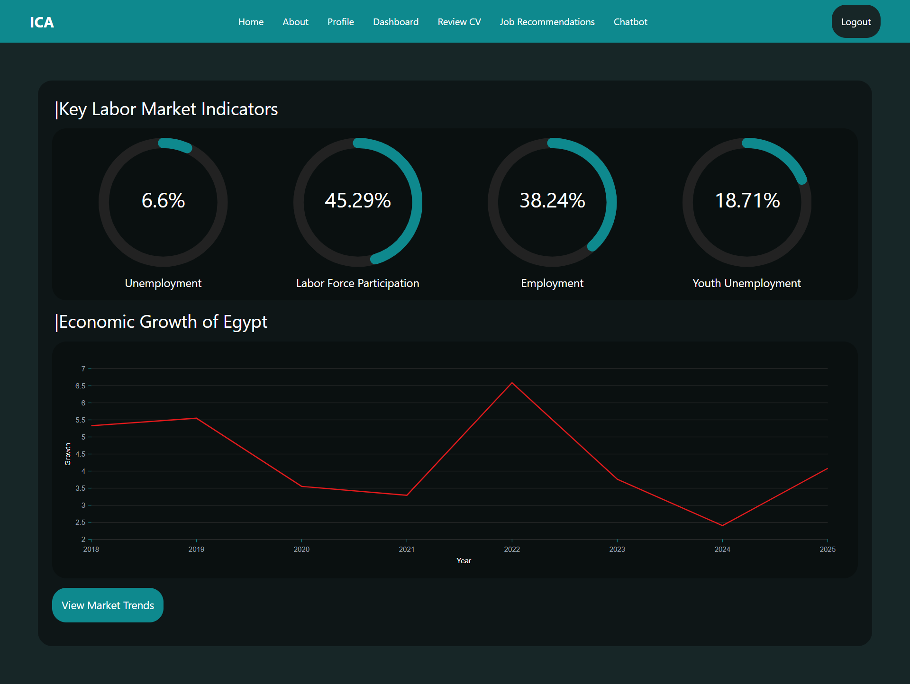
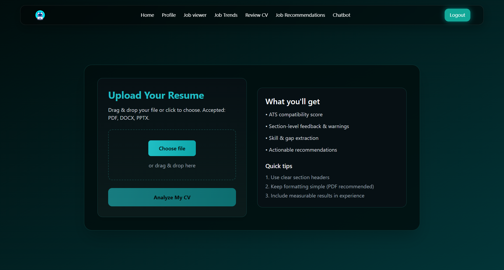
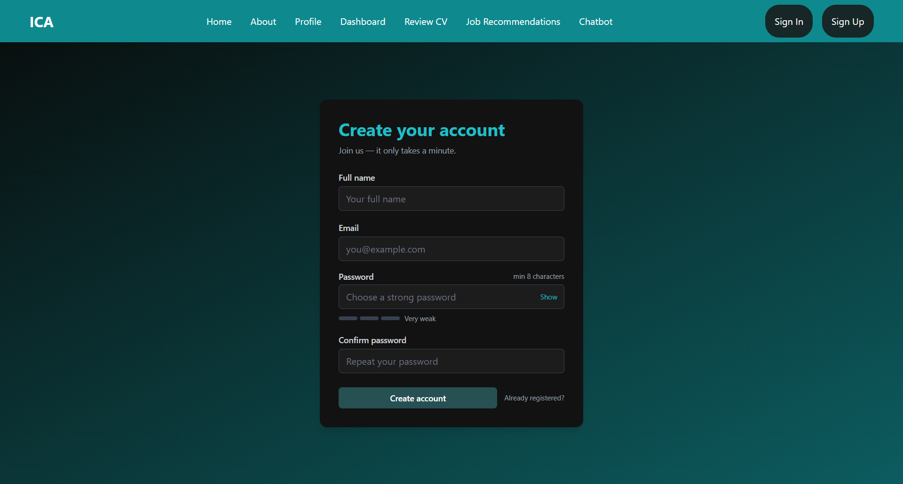

# 🚀 Intelligent Career Advisor & Job Application Platform

> **Transforming AI outputs into a practical career journey.**
> An all-in-one platform connecting job seekers with advanced AI models for resume analysis, interview simulation, and smart job matching.


## 🎥 Project Demo

[](PUT_YOUR_VIDEO_LINK_HERE)

---

## 📖 Overview

**This repository contains the Frontend source code** for the Intelligent Career Advisor platform.

The system is designed to democratize access to advanced career intelligence. It bridges the gap between complex **Deep Learning models** and end-users by providing a seamless, responsive interface for resume auditing, semantic job matching, and interview preparation.

The application connects to a **Deployed Live Python AI Engine** to perform real-time NLP tasks, ensuring that heavy computations are handled server-side while keeping the client fast and lightweight.

## ✨ Key Features

### 👤 User Experience & Management

- **Secure Authentication:** Robust Login/Sign-up system powered by **Firebase Auth**.
- **Interactive Dashboard:** A centralized hub visualizing real-time market data and analytical history using **Nivo Charts**.
- **Profile Customization:** Comprehensive settings to manage personal details and job preferences.

### 🧠 AI-Powered Capabilities (Integrated)

- **Smart Resume Analysis:** Upload PDF CVs to receive detailed, AI-driven feedback (ATS Score, Formatting, Content) via our integrated **Gemini 2.5** pipeline.
- **Semantic Job Matching:** Connects to our vector-based engine (using **BERT** & **FAISS**) to recommend jobs based on skill similarity.
- **Interview Simulation:** An interactive bot environment to practice technical questions.
- **Market Insights:** Live clustering and visualization of job market trends.

## 🛠️ Tech Stack

This project leverages a modern, high-performance technology stack:

### 💻 Frontend (Current Repo)

- **Framework:** React 19, Vite, React Router Dom (v7).
- **Styling:** Tailwind CSS, Lucide React (Icons), React Spring (Animations).
- **Visualization:** Nivo Charts (@nivo/bar, line, pie), Recharts, React Circular Progressbar.

### ⚙️ Backend & Infrastructure

- **BaaS:** Firebase (Authentication, Firestore Database) - _Fully Deployed_.
- **AI Integration:** The frontend consumes live RESTful APIs hosted on our cloud infrastructure.

## 🚀 Getting Started

Since the backend and database are already deployed, you only need to run the frontend to test the application.

### Prerequisites

- Node.js (v18 or higher recommended)
- npm or yarn

### Installation

1.  **Clone the repository**

    ```bash
    git clone [https://github.com/YE-19/NHA-215.git](https://github.com/YE-19/NHA-215.git)
    cd NHA-215
    ```

2.  **Install Dependencies**

    ```bash
    npm install
    ```

3.  **Run the Project**

    ```bash
    npm run dev
    ```

    The app will launch locally at `http://localhost:5173` and automatically connect to our live backend servers.

    ## 📂 Project Structure

A high-level overview of the project's file structure:

```text
NHA-215/
├── public/              # Static assets served directly (Favicon, etc.)
├── src/
│   ├── assets/          # Images, Icons, and global static files
│   ├── components/      # Reusable UI elements (Buttons, Inputs, Charts)
│   ├── layouts/         # Layout wrappers (Sidebar, Navbar structure)
│   ├── pages/           # Main application views (Dashboard, Login, Profile)
│   ├── proutes/         # Protected routing logic & authentication guards
│   ├── App.jsx          # Main component handling Routing structure
│   ├── firebase.js      # Firebase SDK initialization & configuration
│   ├── index.css        # Global styles & Tailwind directives
│   └── main.jsx         # Application entry point (DOM rendering)
├── .firebaserc          # Firebase project aliases
├── firebase.json        # Firebase hosting configuration
├── index.html           # Main HTML entry file
├── postcss.config.js    # PostCSS configuration for Tailwind
├── tailwind.config.js   # Tailwind CSS theme customization
└── vite.config.js       # Vite bundler configuration
```

## 📸 UI Glimpse

A visual walkthrough of the platform's core capabilities:

### 1. Interactive Dashboard

A centralized hub displaying real-time market insights, skill gap analysis, and user progress using dynamic **Nivo Charts**.


### 2. AI Resume Analysis

Detailed feedback screen showing the **ATS Score**, formatting audits, and actionable improvement tips generated by **Gemini AI**.


### 3. Secure Authentication & Onboarding

A robust and secure login/sign-up system powered by **Firebase Authentication**, ensuring safe user data management and seamless session handling.


## 🌐 Deployment

The project is optimized for deployment on modern cloud platforms.

- **Frontend:** Ready for Vercel/Netlify.
- **Backend:** Already Deployed & Active.

## 🤝 Project Structure

The project represents the **Web Interface** of the Intelligent Career Advisor system:

- **Web Team:** Focused on Frontend Architecture (React/Vite), UI/UX Design, and API Integration.
- **AI Team:** Managed the development and deployment of the remote Analytical Models.

## 👥 Meet the Team

Proudly built by the Frontend Development Team:

| Team Member               | Role                             |
| ------------------------- | -------------------------------- |
| **Youssef Ehab Ali**      | Team Leader & Frontend Developer |
| **Mohamed Ahmed Ramadan** | Frontend Developer               |
| **Ziad Borai**            | Frontend Developer               |
| **Mohamed Nader**         | Frontend Developer               |
| **Kermina Ehab**          | Frontend Developer               |

---

<div align="center">
  Built with ❤️ by the <b>Intelligent Career Advisor Team</b>
</div>
